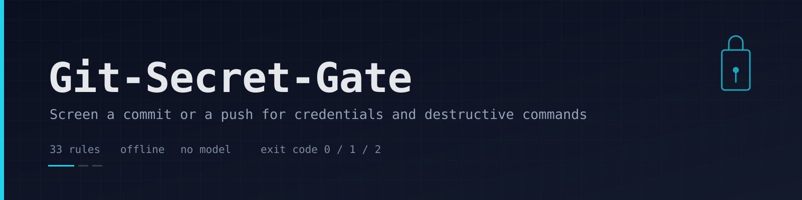

# Git-Secret-Gate

_Русская версия: [README.ru.md](README.ru.md)_

<p align="center">
  
</p>

<p align="center">
  <a href="./LICENSE"></a>
  <a href="./.github/workflows/tests.yml"></a>
  
  
  
</p>

A Git pre-commit and pre-push gate for AI agent repositories: it screens the lines a commit or a push is about to introduce and stops it when it carries a credential, a key file or a destructive command. It has no network access, no model and no service behind it: the check is a set of regular expressions, a set of file-name patterns, an entropy test, and a report that masks every match so a blocked commit never prints the secret into a terminal or a CI log.

---

## Overview

Credentials leave repositories through two doors: the index of a new commit, and the commits that a push sends to a remote. The gate covers both. `pre-commit` screens what `git add` staged; `pre-push` screens the commits inside the range that is about to leave, which is where a key survives after a rebase, an amend or a revert.

The rules are data, not code: 33 of them live in one table, split into credentials (16), destructive commands (10) and host or file-name policy (7). Your own rules go into the same table through `extra_rules` in a `secret-gate.toml`, so a house-specific pattern is one config line rather than a fork.

Everything is deterministic. The hook cannot fail open because a model was unavailable, and it cannot leak a key into a log: the report prints a mask and the length of the match, never the value.

## Architecture

```
git index / git range
        │
        ├── pre-commit  ─→ secret-gate check --staged
        └── pre-push    ─→ secret-gate check --range origin/main..HEAD
                                   │
                                   ▼
                    parse the diff, keep added lines only
                                   │
              ┌────────────────────┼────────────────────┐
              ▼                    ▼                    ▼
      content rules        file-name rules       entropy test
      (secrets, commands,  (key material,        (long random
       private addresses)  env files, stores)    literals)
              │                    │                    │
              └────────────────────┼────────────────────┘
                                   ▼
                        findings → severity merge
                        block / warn, config overrides
                                   │
                    ┌──────────────┴──────────────┐
                    ▼                             ▼
            human report (masked)           --json record
            exit 1 on a blocking find       for a CI pipeline
```

The diff parser keeps only added lines and their file names. A finding carries the rule id, the severity, the file, the line number and the mask; the report sorts by file and line so the output reads like a review rather than a scanner dump. Configuration is resolved by walking up from the working directory to the nearest `secret-gate.toml` or `secret-gate.json`, which means one policy at the root of a tree and no flags in the hook.

## Features

- **Two hooks, one policy.** `pre-commit` screens the staged diff, `pre-push` screens a revision range, so an amended or rebased commit is checked again before it reaches the remote.
- **Masked report.** A blocked commit prints `ghp…(40 chars)`, never the token. The same masking applies to the JSON record, which is what makes the hook safe to run inside CI.
- **Rules as data.** 33 built-in rules across credentials, commands and file names, plus `extra_rules` in the config for anything specific to one environment.
- **File-name policy.** `id_rsa`, `.env`, `*.pem`, `.p12`, `credentials`, `.netrc` and their neighbours are caught by name, so a key file does not need to contain a recognisable string to be stopped.
- **Entropy test.** Long random-looking literals that no vendor pattern describes still surface as warnings.
- **Line-level silence.** `secret-gate: allow` on a line, or a path in `ignore_paths`, mutes a finding without weakening the rest of the tree.
- **Exit codes a script understands.** `0` clean, `1` findings, `2` configuration error — no parsing of human output required.
- **Fast and offline.** The check is local regular expressions over a diff; it runs in milliseconds and works on an air-gapped machine.

## Quick start

```bash
git clone https://github.com/ipanalytics/Git-Secret-Gate.git
cd Git-Secret-Gate
python3 -m venv .venv && . .venv/bin/activate
pip install -e .

# inside the repository you want to protect
cd /path/to/your/repo
secret-gate install          # writes .git/hooks/pre-commit and .git/hooks/pre-push
secret-gate init             # writes a starter secret-gate.toml
```

```console
$ secret-gate check --staged
secret-gate: 2 finding(s) in 1 file(s) (1 blocking, 1 warning)

app.py:1  [block] github-token  ghp…(40 chars)
    a GitHub token: revoke it in Settings, tokens are free to recreate.
app.py:1  [warn] high-entropy-string  ghp…(40 chars)
    a long random-looking literal: if it is a key, rotate it and read it from the environment; if it is a checksum or fixture, add `secret-gate: allow` on the line.

the commit was stopped. Judge each line, then either fix it, or add `secret-gate: allow` on the line itself, or list the path in secret-gate.toml.
$ echo $?
1
```

## Installation

```bash
pip install git+https://github.com/ipanalytics/Git-Secret-Gate.git   # from the repository
pip install -e ".[dev]"                                             # working copy with pytest and ruff
```

The package is pure Python and has no runtime dependencies. Python 3.10 or newer.

## Usage

| Command | What it does |
| --- | --- |
| `secret-gate check --staged` | Screens the index — the same view a commit would create. This is the default. |
| `secret-gate check --range origin/main..HEAD` | Screens every added line in a revision range, for a push. |
| `secret-gate check --last` | Screens the last commit only. |
| `secret-gate check --file path/to/file` | Screens one file from disk. |
| `secret-gate check --stdin` | Screens text from a pipe. |
| `secret-gate install` | Writes the two hooks into `.git/hooks/`; deletes them if the files already exist and are not its own. |
| `secret-gate init` | Writes a commented `secret-gate.toml` with the defaults. |
| `secret-gate rules` | Prints every active rule with its severity, kind and hint. |

Useful modifiers: `--json` prints the record instead of the lines, `--quiet` prints nothing and only sets the exit code, `--warn-as-error` promotes warnings, `--no-entropy` turns the entropy test off, `--limit N` caps the lines printed, `--config PATH` points at a specific policy.

**Exit codes**

| Code | Meaning |
| --- | --- |
| `0` | Nothing blocking (warnings may still be listed). |
| `1` | At least one blocking finding: the commit or push should stop. |
| `2` | The configuration is broken — a rule has no pattern, a regex does not compile. |

## Rules

`secret-gate rules` prints the live table. What it covers:

| Kind | Count | Examples |
| --- | --- | --- |
| `secret` | 16 | GitHub, GitLab, Slack, Telegram and Google tokens; AWS and OpenAI keys; Stripe secrets; JWTs; private key headers; passwords inside URLs; IBAN |
| `command` | 10 | `rm -rf` on a root path, `dd` to a device, `mkfs`, `chmod 777 /`, `curl … \| sh`, force-push, history rewrite, fork bomb |
| `policy` | 7 | private addresses, home directory paths, internal host names, and the file-name rules for key material, `.env` and credential stores |

Severity is separate from kind: 26 rules block, 7 warn. A warning is a line a human should read, not a line that stops a commit — unless `warn_as_error` is set.

## Configuration

`secret-gate.toml` (or the same object in `secret-gate.json`) is looked up from the working directory upwards.

| Key | Type | Default | Meaning |
| --- | --- | --- | --- |
| `kinds` | list | `["secret", "command", "policy"]` | Which rule kinds are active. |
| `warn_as_error` | bool | `false` | Treat warnings as blocking findings. |
| `check_entropy` | bool | `true` | Run the random-looking-literal test. |
| `ignore_paths` | list | `["tests/fixtures/**", "*.lock", "node_modules/**"]` | Glob patterns the gate does not look at. |
| `ignore_rules` | list | `[]` | Rule ids muted in this repository. |
| `extra_rules` | list | `[]` | Your own rules, same shape as the built-in ones. |

```toml
[[extra_rules]]
id = "internal-hostname"
pattern = "\\b[a-z0-9-]+\\.our\\.lan\\b"
severity = "block"
kind = "policy"
hint = "an internal host name: keep it in a local config."
where = "text"          # "text" matches the line, "path" matches the file name
```

An extra rule with `where = "path"` is matched against file names exactly like the built-in policy rules, which is how a naming convention of your own becomes a gate condition.

## Outputs

**Human report** — one block per finding, grouped by file and line, ending with the reason the commit stopped and the three ways out: fix the line, add `secret-gate: allow`, or list the path in the config.

**JSON record** (`--json`), stable enough to store:

| Field | Meaning |
| --- | --- |
| `summary.findings` | Total findings. |
| `summary.blocking` / `summary.warnings` | Split by severity. |
| `summary.files` | Files touched by at least one finding. |
| `summary.failed` | Whether the run stopped the commit. |
| `summary.warn_as_error` | Whether warnings were promoted. |
| `findings[].rule` / `.severity` / `.kind` | Which rule fired and how it is classified. |
| `findings[].path` / `.line` | Where it fired. |
| `findings[].masked` | The mask, with the length of the match — never the value. |
| `findings[].hint` | What to do about it. |

## Continuous integration

The gate works as a pipeline step as well as a hook; the record is the part a reviewer reads.

```yaml
- name: secret gate
  run: |
    pip install git+https://github.com/ipanalytics/Git-Secret-Gate.git
    secret-gate check --range "origin/${{ github.base_ref }}..HEAD" --json > gate.json
```

A non-zero exit fails the step; `gate.json` carries the masked findings as an artifact.

## Operational notes

- I install the hooks in every repository on the machine with the same command; `secret-gate install` is idempotent and removes its own files on request, so uninstalling is a file deletion rather than a config hunt.
- A push that rewrites history is screened twice: once when the commits are created and once when the range leaves. The second pass is the one that catches a key that was added before the hook existed in a branch that was rebased.
- Documentation and fixtures are deliberately not excluded by default. If a fake token in a test fixture is legitimate, mark the line with `secret-gate: allow` rather than widening `ignore_paths` — an excluded directory stays excluded after the fixture is gone.
- The report is the interface. Anything that would need the raw value — a rotation tool, an incident note — reads it from the provider, not from the hook output.
- `--quiet` exists for cron jobs and for hooks where the human only sees the exit code.

## Project scope

The gate covers what a diff can show: strings in added lines, file names in the added set, and the commands those lines contain. It does not scan history, does not talk to providers to validate or revoke a key, and does not decide whether a finding is a real credential — that judgement stays with the person reading the report.

## Use cases

- **A repository that must not carry a key.** The hook is the last line of defence before a token reaches a remote, and it is cheap enough to run on every commit.
- **A machine with several repositories under one policy.** One `secret-gate.toml` at the root of the tree, resolved by walking up, keeps the policy in one file.
- **A pipeline that screens a pull request.** `--range base..HEAD --json` turns the gate into a CI step whose output a reviewer can read.
- **A house rule that no public scanner knows.** An internal host name, a naming convention for fixtures, a private address range: `extra_rules` puts it in the same table as everything else.
- **An air-gapped or offline build machine.** No network, no model, no key of its own.

## Limitations

- It reads a diff, not a history. A key that is already in the repository's past stays there; the gate stops the next one, and rotation is a separate job.
- Patterns describe shapes, not truth. A well-formed fake token is reported, and a real credential in an unrecognised format can pass — the entropy test narrows that gap without closing it.
- It cannot tell whether a match is still valid. Validation and revocation belong to the provider's API.
- File-name rules depend on names. A key file renamed to something ordinary is invisible to them.
- The ruleset is opinionated; `ignore_rules` and `kinds` exist because a real repository always disagrees with someone else's defaults.

## Repository layout

```
Git-Secret-Gate/
├── git_secret_gate/
│   ├── patterns.py      # the rule table: 33 rules, four groups
│   ├── scan.py          # content rules, name rules, entropy, masking
│   ├── diff.py          # added lines from the index, a range or the last commit
│   ├── policy.py        # config lookup upward, extra rules, ignores
│   ├── report.py        # the human report and the JSON record
│   ├── cli.py           # check, install, init, rules; exit codes
│   └── __main__.py      # python -m git_secret_gate
├── tests/
│   └── test_gate.py     # 21 tests over rules, masking, config and the CLI
├── site/banner.svg
├── .github/workflows/tests.yml
├── pyproject.toml
└── LICENSE
```

## Testing

```bash
python -m pytest -q      # 21 tests
ruff check . && ruff format --check .
```

The suite covers the rule table (unique ids, valid severities), each class of finding, the masking of a report, the `allow` marker, the diff parser, config lookup and extra rules, the JSON record and the CLI exit codes.

## Deployment

Copy the package to the machine and install it in the environment the hook will use:

```bash
pipx install git+https://github.com/ipanalytics/Git-Secret-Gate.git   # one command per machine
secret-gate install                                                  # per repository
```

The hook records the interpreter it was installed with, so a repository checked out on a machine without that interpreter fails the hook loudly instead of skipping the check.

## License

MIT — see [LICENSE](./LICENSE).

## Disclaimer

The gate reduces the chance that a credential leaves a machine; it does not remove the need to rotate a key that has already been published. Treat a blocked commit as a signal to review the line, not as proof that the repository is clean.
